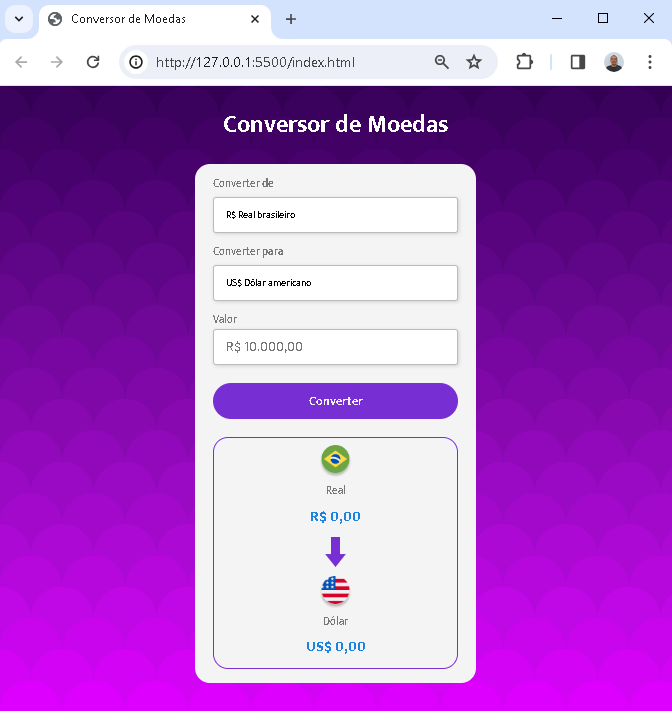

# Conversor de Moedas

Olá! 👋 Este é o meu projeto de conversor de moedas, desenvolvido utilizando as tecnologias HTML, CSS e Javascript.

    

## LinkedIn

Vamos conectar no LinkedIn! Você pode encontrar mais sobre mim e meu trabalho <a href="https://www.linkedin.com/in/tiago-grillo-lermy/" target="_blank">aqui</a>.

## Como Contribuir

Se você encontrar problemas, bugs ou tiver sugestões de melhorias, ficarei muito grato em receber contribuições! Sinta-se à vontade para abrir uma issue ou enviar um pull request. Juntos, podemos tornar este projeto ainda melhor! 🚀
